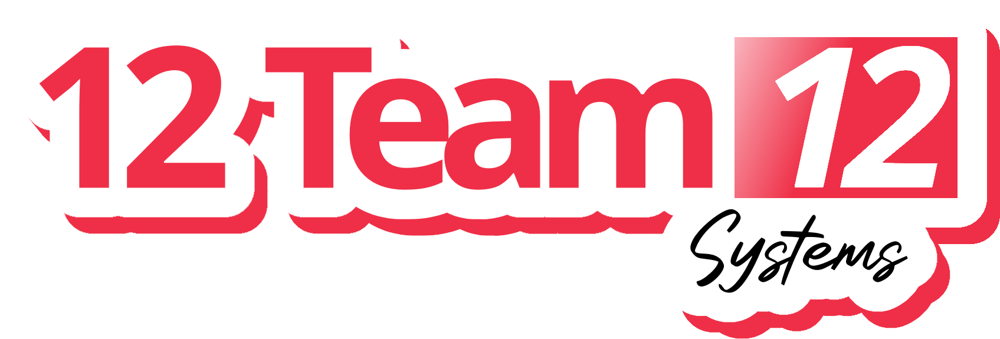

# 12 Team 12 Systems



This is a very serious project regarding sugar chicken.

# Authors
- https://github.com/cdavis328
- https://github.com/nathan-on-git
- https://github.com/eoe789
- https://github.com/FrozenEarth-git
- https://github.com/camdenbalberg
- https://github.com/Divenchy

# QUICKSTART
This product utilizes the following tech-stack:
  - Front-end: Vue.js + Vite build tool, Tailwind CSS
  - Back-end: Ruby on RAILS
  - Web-Server: Nginx
  - Database: PostgreSQL (hosted on AWS)
  - Deployment & Infrastructure: Docker
  - And Several APIs: Google OAuth2, Google Translate, OpenWeather


Before anything download the .env file in the team google drive and include it inside the cloned repository

- [Windows users](#WINDOWS)
- [Linux users](#LINUX)

## WINDOWS
#### Prerequisites
Download and install Docker Desktop [here](https://docs.docker.com/desktop/install/windows-install/)

I recommend also installing general tools to build both the backend and or the front end individually if necessary:
- Download ruby for backend development (for C gems, uses MSYS2!!): [download](https://rubyinstaller.org/)
  Then proceed to install rails:
  ```
  ## Verify ruby installed correctly and is on PATH (may need to restart shell)
  ruby --version

  # Now install rails
  gem install rails
  ```
- Download Node.js (LTS version, currently 20.18): [download](https://nodejs.org/en)
- Download postgreSQL 17 (if not installed already): [download](https://www.enterprisedb.com/downloads/postgres-postgresql-downloads)

## Run app
!!! Make sure Docker engine is running (easiest way of doing this is launching Docker Desktop)

To start up the containers and launch both the front and backend:
`docker-compose up --build`

Alternatively, let Docker Desktop find the container and images and run there.

### Connecting to App
~~To connect to database: http://localhost:3000/~~

~~To connect to web app: http://localhost:5173/  , or if using terminal simply the link provided in the terminal~~

Now that Nginx has been added and being used as a reverse proxy, in your browser:
`http://localhost` or simply `localhost`

And to connect to specific rails controllers (backend API):
`http://localhost/api/v1/menu_items`

### Running the backend
If you choose not to use Docker to run individually, do the following before doing any of the steps below:
```
gem install bundler
cd panda-web-app-backend
bundle install
```

To run the backend only, you can do either the following:
- In the main project folder: `docker-compose up --build backend`
- In the folder panda-web-app-backend: rails s[erver]

If adding new gems to the rails project:
```
# Alternatively code (in root folder) code panda-web-app-backend/Gemfile
cd panda-web-app-backend
code .
##### Edit Gemfile (then returning to cli)
bundle install   # Configures project with the updated gems
```

### Running the frontend

Make sure you have Node.js installed from [prerequisites](#Prerequisites) and npm is on path:
```
npm --version
10.8.2
```
If using Docker, you can run the container like so:
`docker-compose up --build frontend`

Otherwise, after verifying npm command, do the following in order to install all dependencies for Vite + Vue app:
```
cd panda-web-app-frontend
npm install
```
Then to run the development server using npm:
```
npm run dev
```

Although you are able to run each the backend and frontend individually without the use of Docker and containers, it is highly discouraged and might not work as expected due to port configuration.

## LINUX

### Prerequisites
In order to begin development on the app, download all the required packages:
- (Do not copy and paste all, only what you choose or need) Using the package manager of choice or for your distribution:
  ```
  sudo apt update && sudo apt upgrade
  # Install nvm (Node Version Manager)
  curl -o- https://raw.githubusercontent.com/nvm-sh/nvm/v0.39.5/install.sh | bash

  # Load nvm  or alternatively source shell (e.g. source ~/.bashrc)
  export NVM_DIR="$HOME/.nvm"
  [ -s "$NVM_DIR/nvm.sh" ] && \. "$NVM_DIR/nvm.sh"

  # Install the desired version of Node.js
  nvm install 20
  nvm use 20

  # Install dependencies & postgresql (if already installed exclude)
  sudo apt install -y build-essential libssl-dev libreadline-dev zlib1g-dev postgresql postgresql-contrib libpq-dev

  ####### Install Ruby using RVM
  \curl -sSL https://get.rvm.io | bash -s stable --ruby

  # Load RVM
  source ~/.rvm/scripts/rvm

  # or instead
  sudo apt-get install ruby-full
   
  # Install Rails
  gem install rails
  gem install bundler
  ```
Then ensure everything is set up properly:
```
node -v
npm -v
ruby -v
rails -v
psql --version
git --version
```
You could also install Docker Desktop for your distro here: [instructions](https://docs.docker.com/desktop/install/linux/)

## Run app
!!!! Make sure Docker engine is running (easiest way of doing this is launching Docker Desktop)

To start up the containers and launch both the front and backend:
`docker-compose up --build`

Alternatively, let Docker Desktop find the container and images and run there.

### Connecting to App
~~To connect to database: http://localhost:3000/~~

~~To connect to web app: http://localhost:5173/  , or if using terminal simply the link provided in the terminal~~

Now that Nginx has been added and being used as a reverse proxy, in your browser:
`http://localhost` or simply `localhost`

And to connect to specific rails controllers (backend API):
`http://localhost/api/v1/menu_items`

### Running the backend
If you choose not to use Docker to run individually, do the following before doing any of the steps below:
```
gem install bundler
cd panda-web-app-backend
bundle install
```

To run the backend only, you can do either the following:
- In the main project folder: `docker-compose up --build backend`
- In the folder panda-web-app-backend: rails s[erver]

If adding new gems to the rails project:
```
# Alternatively in root folder: vim panda-web-app-backend/Gemfile
cd panda-web-app-backend
vim Gemfile   ## Edit Gemfile (add new Gem)
bundle install   # Configures project with the updated gems
```

### Running the frontend

Make sure you have Node.js installed from [prerequisites](#Prerequisites) and npm is on path:
```
npm --version
10.8.2
```
If using Docker, you can run the container like so:
`docker-compose up --build frontend`

Otherwise, after verifying npm command, do the following in order to install all dependencies for Vite + Vue app:
```
cd panda-web-app-frontend
npm install
```
Then to run the development server using npm:
```
npm run dev
```

## Documentation
We are using Vuese to generate documentation.

```
cd panda-web-app-frontend
vuese gen --title "Project 3 - 12 Team 12" 
(select Docute)

vuese serve --open
```

For more information on how to annotate your code for Vuese to document it, see https://vuese.github.io/website/cli/#writing-documentation-for-your-component.
